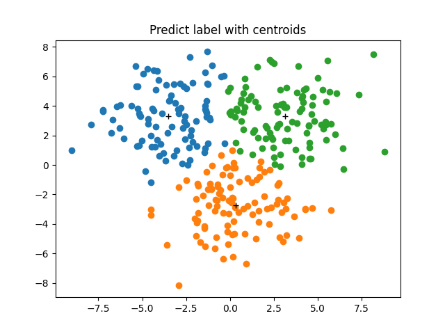

# CSE 6363 Machine Learning

- Student ID: 1001778270
- Name: Bo Lin

## Assignment 03

> Explain why the K-means objective function decreases in each of the two steps
> in Kmean algorithm: (a) re-assign every data points to their nearest cluster
> centroids. (b) Given the grouping (or clustering), re-computer the cluster
> centroids.

$$ J = \sum_{n=1}^{N}{\sum_{k=1}^{K}{r_{nk} \parallel x_n - \mu_k \parallel^2}} $$

We need to prove the objective function is monotonous and bounded. All data
re-assign to the nearest cluster centroid in each step, so:

$$ J_0(\mu_1, \mu_2 ... \mu_k) \geq J_1(\mu_1, \mu_2 ... \mu_k) $$

where $J_0$ is the objective function before re-assign and $J_1$ is the
objective function after re-assign.

and then we need to re-compute the cluster centroids, so:

$$ \sum_{n=1}^{N}(x_n - \mu) \geq \sum_{n=1}^{N}(x_n - \mu_{avg}) $$

so in the re-assign step, the objective funtion is decreased and in the
re-compute step, the objective function is also decreased, so the objective
function is monotonous.

and we also know:

$$ J \geq 0 $$

so objective function is monotonous and bounded, so kmeans algorithm is convergent.

> (A) Generate Three Gaussian distributions, each with 100 data points in 2
> dimensions, with centers at $(3,3)$, $(-3,3)$, and $(0,-3)$ and standard deviation
> $\sigma$ = 2. Draw them in a Figure. Set K=3, do K-means clustering. Show the
> clustering results in the same Figureand compute the converged K-mean loss.
> Repeat this 5 times. Submit the 5 figuresand losses, each represent the result
> of each K-means clustering.(B) Everything are same as (A), but with $\sigma$ = 4.
> Submit the 5 figuresand losses.

- A


```plain
Centroids:
        [-3.52663914  3.29797089]
        [3.13337369 3.29078797]
        [ 0.31807236 -2.718626  ]
KMeans Loss: 2103.7424889
```



```plain
Centroids:
        [-3.52663914  3.29797089]
        [ 0.31807236 -2.718626  ]
        [3.13337369 3.29078797]
KMeans Loss: 2103.7424889
```


```plain
Centroids:
        [-3.52663914  3.29797089]
        [3.09117102 3.23919899]
        [ 0.30578004 -2.78450298]
KMeans Loss: 2103.9461490
```


```plain
Centroids:
        [ 0.31807236 -2.718626  ]
        [3.13337369 3.29078797]
        [-3.52663914  3.29797089]
KMeans Loss: 2103.7424889
```


```plain
Centroids:
        [ 0.31807236 -2.718626  ]
        [3.13337369 3.29078797]
        [-3.52663914  3.29797089]
KMeans Loss: 2103.7424889
```

- B


```plain
Centroids:
        [ 1.70491562 -3.76988003]
        [4.20705161 4.5737617 ]
        [-4.17516068  2.58271482]
KMeans Loss: 5380.7378981
```


```plain
Centroids:
        [ 1.66477425 -3.7177851 ]
        [-3.82110505  2.78625512]
        [4.64781363 4.63646994]
KMeans Loss: 5385.5353109
```


```plain
Centroids:
        [-3.82110505  2.78625512]
        [ 1.66477425 -3.7177851 ]
        [4.64781363 4.63646994]
KMeans Loss: 5385.5353109
```


```plain
Centroids:
        [-3.82110505  2.78625512]
        [4.64781363 4.63646994]
        [ 1.66477425 -3.7177851 ]
KMeans Loss: 5385.5353109
```


```plain
Centroids:
        [-3.82110505  2.78625512]
        [ 1.66477425 -3.7177851 ]
        [4.64781363 4.63646994]
KMeans Loss: 5385.5353109
```
