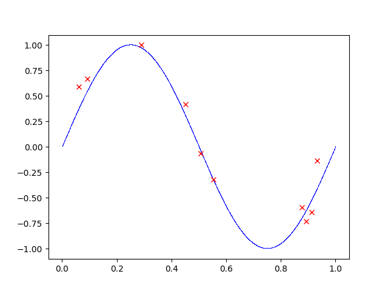
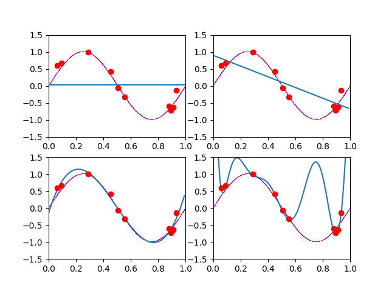
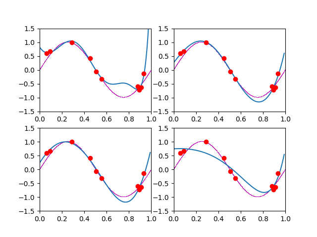

# CSE 6363 Machine Learning

- Student ID: 1001778270
- Name: Bo Lin

## Computer Project 1

- Python: 3.7.6
- Numpy: 1.18.1
- Pandas: 1.0.1
- Matplotlib: 3.1.3

**Computer Project 1A:** `gen_random_data` in `utils.py`

**Computer Project 1B:** `LinearRegression` with parameter `regularization` is `None` in `linear_model.py`

**Computer Project 1C:** `LinearRegression` with parameter `regularization` is not `None` in `linear_model.py`

**Computer Project 1D:** `NaiveBayes` in `naive_bayes.py`


## Usage

Execute the following command in your terminal

```sh
python test.py
```

## Results

- Computer Project 1A



- Computer Project 1B



- Computer Project 1C



- Computer Project 1D

```
Label: mammal
Probs:
     mammal: 0.0998089 <
    reptile: 0.0003219 
       fish: 0.0000954 
  amphibian: 0.0000374 
       bird: 0.0004486 
--------------------------
Label: reptile
Probs:
     mammal: 0.0002426 
    reptile: 0.0106813 <
       fish: 0.0026703 
  amphibian: 0.0003926 
       bird: 0.0000582 
--------------------------
Label: fish
Probs:
     mammal: 0.0001132 
    reptile: 0.0046731 
       fish: 0.0373846 <
  amphibian: 0.0001145 
       bird: 0.0000763 
--------------------------
Label: mammal
Probs:
     mammal: 0.0558930 <
    reptile: 0.0002503 
       fish: 0.0053407 
  amphibian: 0.0000436 
       bird: 0.0002617 
--------------------------
Label: amphibian
Probs:
     mammal: 0.0003184 
    reptile: 0.0070096 
       fish: 0.0004381 
  amphibian: 0.0278223 <
       bird: 0.0004580 
--------------------------
Label: reptile
Probs:
     mammal: 0.0002022 
    reptile: 0.0060082 <
       fish: 0.0006676 
  amphibian: 0.0000981 
       bird: 0.0001309 
--------------------------
Label: mammal
Probs:
     mammal: 0.3892548 <
    reptile: 0.0006974 
       fish: 0.0000775 
  amphibian: 0.0004860 
       bird: 0.0019441 
--------------------------
Label: bird
Probs:
     mammal: 0.0108126 
    reptile: 0.0020922 
       fish: 0.0002325 
  amphibian: 0.0002430 
       bird: 0.0262451 <
--------------------------
Label: mammal
Probs:
     mammal: 0.1497134 <
    reptile: 0.0009656 
       fish: 0.0002861 
  amphibian: 0.0001122 
       bird: 0.0013459 
--------------------------
Label: fish
Probs:
     mammal: 0.0010189 
    reptile: 0.0017524 
       fish: 0.0373846 <
  amphibian: 0.0000572 
       bird: 0.0000382 
--------------------------
Label: reptile
Probs:
     mammal: 0.0000708 
    reptile: 0.0070096 <
       fish: 0.0011683 
  amphibian: 0.0005152 
       bird: 0.0002290 
--------------------------
Label: bird
Probs:
     mammal: 0.0014555 
    reptile: 0.0015021 
       fish: 0.0002503 
  amphibian: 0.0005888 
       bird: 0.0070660 <
--------------------------
Label: mammal
Probs:
     mammal: 0.2245701 <
    reptile: 0.0012875 
       fish: 0.0001431 
  amphibian: 0.0006730 
       bird: 0.0008973 
--------------------------
Label: fish
Probs:
     mammal: 0.0001132 
    reptile: 0.0046731 
       fish: 0.0373846 <
  amphibian: 0.0001145 
       bird: 0.0000763 
--------------------------
Label: amphibian
Probs:
     mammal: 0.0003184 
    reptile: 0.0070096 
       fish: 0.0004381 
  amphibian: 0.0278223 <
       bird: 0.0004580 
--------------------------
```