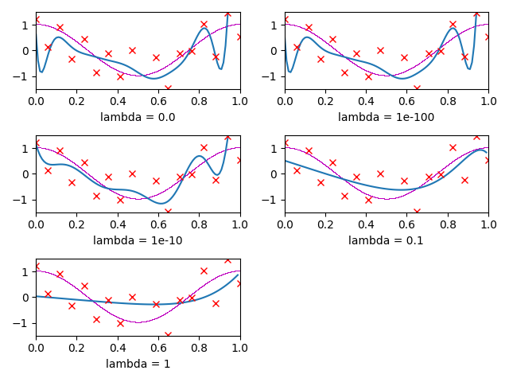

# # CSE 6363 Machine Learning

- Student ID: 1001778270
- Name: Bo Lin

## Usage

```sh
python question_1.py
```

## Question 1


## Question 2


```plain
M = 0
[-0.03359266]
M = 1
[-0.06203574  0.05688617]
M = 10
[ 1.18606369e+00 -3.66291066e+01  4.30438195e+02 -3.84607347e+02
 -2.13988914e+04  1.50338602e+05 -4.75669659e+05  8.32560718e+05
 -8.30862901e+05  4.43105598e+05 -9.80833033e+04]
M = 16
[ 1.49068038e+00  1.59465762e+02 -8.06815065e+03  1.42431210e+05
 -1.27779056e+06  6.60645722e+06 -2.05311372e+07  3.69129016e+07
 -2.85492655e+07 -2.15145537e+07  7.01436824e+07 -5.72494517e+07
  5.14793172e+06  1.69301376e+07 -4.52573799e+06 -3.93283824e+06
  1.70514125e+06]
M = 17
[ 6.23449313e-01 -1.43034182e+02  4.63538910e+03 -6.19344386e+04
  4.44693318e+05 -1.88318504e+06  4.70828455e+06 -6.01958882e+06
  4.65463401e+05  8.65712797e+06 -6.05258478e+06 -9.74225235e+06
  1.50209778e+07 -2.07359895e+06 -5.79462473e+06  3.69737678e+05
  3.23201245e+06 -1.27502044e+06]
```

## Question 3



```plain
lambda = 0.0
[ 6.23449313e-01 -1.43034182e+02  4.63538910e+03 -6.19344386e+04
  4.44693318e+05 -1.88318504e+06  4.70828455e+06 -6.01958882e+06
  4.65463401e+05  8.65712797e+06 -6.05258478e+06 -9.74225235e+06
  1.50209778e+07 -2.07359895e+06 -5.79462473e+06  3.69737678e+05
  3.23201245e+06 -1.27502044e+06]
lambda = 1e-100
[ 6.23449313e-01 -1.43034182e+02  4.63538910e+03 -6.19344386e+04
  4.44693318e+05 -1.88318504e+06  4.70828455e+06 -6.01958882e+06
  4.65463401e+05  8.65712797e+06 -6.05258478e+06 -9.74225235e+06
  1.50209778e+07 -2.07359895e+06 -5.79462473e+06  3.69737678e+05
  3.23201245e+06 -1.27502044e+06]
lambda = 1e-10
[ 1.15834250e+00 -2.90946674e+01  3.81841484e+02 -2.21903812e+03
  5.66175466e+03 -5.49539664e+03 -1.52069294e+02  9.93542065e+02
  8.33960523e+02  1.92900975e+03  1.84843200e+03 -8.60841938e+02
 -4.19004966e+03 -4.61333502e+03 -3.72389420e+02  6.14637031e+03
  7.64080911e+03 -7.50412860e+03]
lambda = 0.1
[ 0.51411167 -2.54203692 -0.23013566  0.78670589  1.10278189  1.08857037
  0.93276987  0.72711343  0.51482903  0.31498513  0.13466683 -0.02484371
 -0.16490247 -0.28789072 -0.39641366 -0.49292502 -0.57957375 -0.65816366]
lambda = 1
[ 0.03306366 -0.65620849 -0.11216244  0.16087425  0.26977293  0.29502253
  0.27973912  0.24603037  0.20516973  0.1628432   0.12182178  0.08334644
  0.04785977  0.0153977  -0.01419956 -0.04117446 -0.06579263 -0.08831281]
```